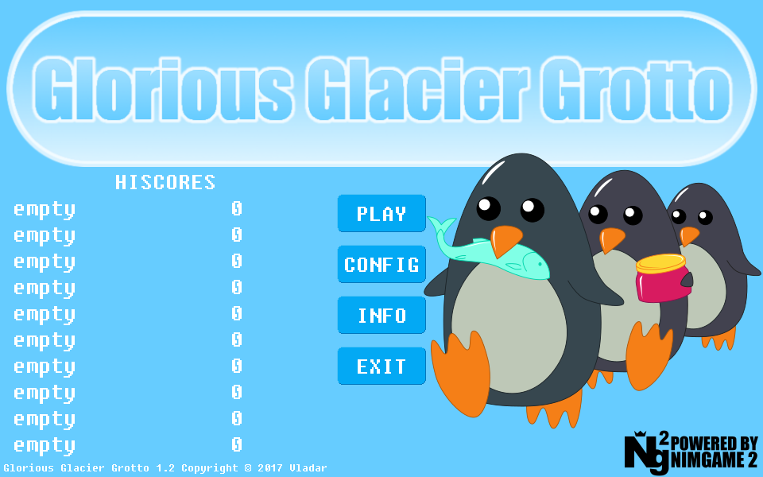
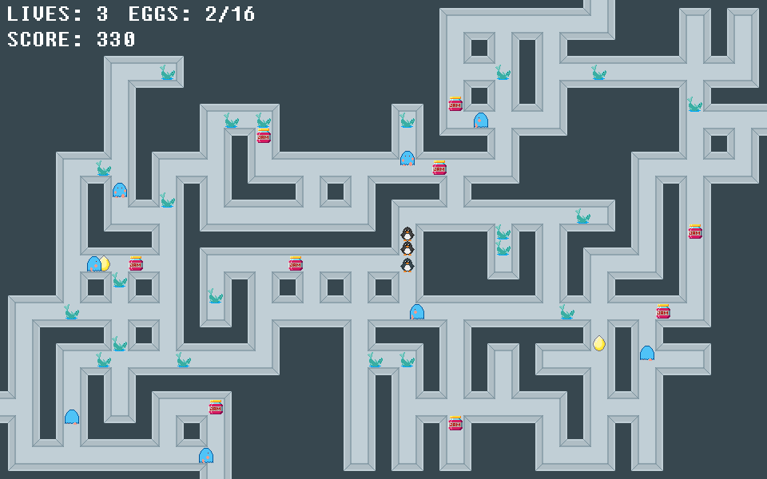

Glorious Glacier Grotto
=======================

[The Linux Game Jam 2017](https://itch.io/jam/linux-jam-2017) participant.

A procedurally-generated labyrinth-exploring penguin-themed game.

Goal
----

To win the game you must collect all the eggs, while evading the yetis.
Each egg gives you one more partner, increasing your score multiplier.
The more partners you have, the faster you are.

Controls
--------

WASD or arrow keys.

Links
-----

[itch.io page](https://vladar.itch.io/glorious-glacier-grotto)

[v1.01 release (binaries)](https://github.com/Vladar4/ng2gggrotto/releases/tag/v1.01)

--------

[Nim](https://github.com/nim-lang/Nim)

[SDL2_nim](https://github.com/Vladar4/sdl2_nim)

[Nimgame 2](https://vladar4.github.io/nimgame2/)

Screenshots
-----------

